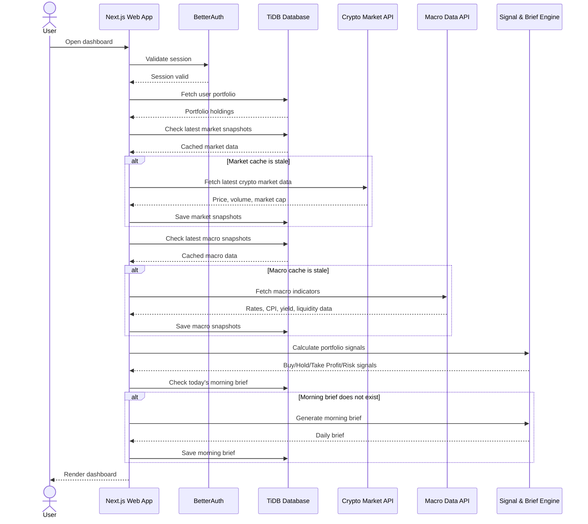
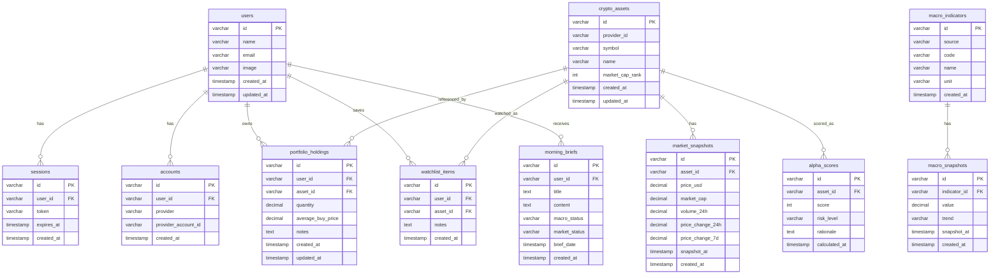

# 1. Overview

## Product Name

**Crypto Alpha Portfolio Tracker**

## Product Summary

A responsive web app for tracking a personal crypto portfolio, monitoring macroeconomic conditions, generating a daily crypto morning brief, and discovering potential altcoin opportunities through a simple “alpha hunter” scoring system.

The MVP should focus on **manual portfolio tracking + market intelligence**, not automated trading. Buy/sell signals should be presented as **decision support**, not financial advice.

## Target Users

Primary target user:

* Retail crypto investor
* Wants to track portfolio performance
* Wants simplified macro analysis related to crypto
* Wants help finding interesting altcoins before they become popular
* Has limited time to manually check multiple sites every morning

## MVP Goal

Build a lightweight web app that allows users to:

1. Sign in with Google.
2. Add and manage crypto holdings manually.
3. View portfolio value, profit/loss, and allocation.
4. See buy/sell/watch signals based on predefined rules.
5. Receive a daily morning brief generated from market and macro indicators.
6. Discover altcoin candidates using a basic alpha scoring model.

## Product Positioning

This product is similar in spirit to crypto intelligence dashboards like `apiu.ai`, but the MVP should not attempt to fully replicate advanced AI trading platforms.

The MVP should be:

* Personal portfolio-first
* Insight-focused
* Simple enough to build and maintain with a low budget
* Expandable into a more advanced crypto intelligence platform later

## Recommended MVP Scope

The first version should **not** include:

* Automated trading
* Exchange API trading
* Wallet connection
* Complex on-chain analytics
* Paid data feeds
* Real-time WebSocket infrastructure
* Personalized financial recommendations

The first version should include:

* Manual portfolio input
* Market price sync
* Rule-based signals
* Simple AI-generated summaries
* Macro indicator tracking
* Altcoin discovery dashboard

---

# 2. Requirements

## 2.1 Functional Requirements

### Authentication

Users must be able to:

* Sign in using Google OAuth.
* Have a private account.
* Access only their own portfolio and watchlist data.
* Sign out securely.

Recommended implementation:

* Use **BetterAuth** with Google provider.
* Store user sessions in the database.
* Protect all dashboard routes using server-side auth checks.

---

### Portfolio Tracking

Users must be able to:

* Add crypto holdings manually.
* Edit holdings.
* Delete holdings.
* Input:

  * Coin/token
  * Symbol
  * Quantity
  * Average buy price
  * Optional notes
* View:

  * Current price
  * Current value
  * Unrealized profit/loss
  * Profit/loss percentage
  * Portfolio allocation by asset

MVP should use market data from a public crypto price API.

CoinGecko is a suitable MVP candidate because it provides REST API access for crypto market data, including prices, market data, and coin metadata. ([CoinGecko API][1])

---

### Buy/Sell Dashboard

The dashboard should display simple rule-based signals:

* **Buy Zone**
* **Hold**
* **Take Profit**
* **Risk Warning**
* **Watchlist Candidate**

Signals must be based on transparent logic.

Example MVP signal rules:

| Signal              | Rule                                                                                  |
| ------------------- | ------------------------------------------------------------------------------------- |
| Buy Zone            | Asset is down more than 20% from user average buy price but macro risk is low/neutral |
| Hold                | Price is within -10% to +20% from average buy price                                   |
| Take Profit         | Asset is up more than 40% from average buy price                                      |
| Risk Warning        | Asset is down more than 30% and market sentiment is extreme fear                      |
| Watchlist Candidate | Alpha score is above 70 but user does not own the asset                               |

Important constraint:

The app should avoid saying “you must buy” or “you must sell.” Use softer language such as:

* “Potential buy zone”
* “Consider reviewing”
* “Risk level increased”
* “Profit-taking zone detected”

---

### Morning Brief

Users must be able to view a daily brief containing:

* Overall crypto market condition
* Bitcoin price trend
* Ethereum price trend
* Fear & Greed Index
* Macro indicators
* Notable portfolio changes
* Top altcoin watchlist candidates
* Suggested actions to review

The brief should be generated once per day per user.

For MVP, the brief can be generated when the user opens the dashboard for the first time each day.

Recommended sources:

* Crypto market data from CoinGecko.
* Crypto Fear & Greed Index from Alternative.me.
* Macro data from FRED.

Alternative.me provides a Crypto Fear & Greed Index and public API access for crypto sentiment data. ([Alternative.me][2])

FRED provides API access for economic data series, but it requires an API key for web service requests. ([FRED][3])

---

### Macro Economy Analysis

The system should track macro indicators that commonly affect crypto risk appetite.

MVP indicators:

| Indicator                | Purpose                            |
| ------------------------ | ---------------------------------- |
| Fed Funds Rate           | Measures interest rate environment |
| CPI YoY                  | Inflation pressure                 |
| DXY / USD strength proxy | Risk asset pressure                |
| 10Y Treasury Yield       | Liquidity/risk appetite proxy      |
| M2 Money Supply          | Liquidity environment              |
| Unemployment Rate        | Economic cycle context             |

MVP macro output should be simplified into:

* **Risk-On**
* **Neutral**
* **Risk-Off**

Example logic:

```text
IF Fed Funds Rate is rising
AND CPI is above target
AND 10Y Yield is rising
THEN macro status = Risk-Off

IF inflation is cooling
AND rates are stable/falling
AND liquidity is improving
THEN macro status = Risk-On

ELSE macro status = Neutral
```

---

### Alpha Hunter

The Alpha Hunter feature should help users discover altcoins based on measurable public data.

MVP scoring factors:

| Factor                                 | Weight |
| -------------------------------------- | -----: |
| 24h volume growth                      |    20% |
| 7d price momentum                      |    20% |
| Market cap rank                        |    15% |
| Liquidity / volume-to-market-cap ratio |    20% |
| Category/narrative relevance           |    15% |
| Volatility risk penalty                |   -10% |

Alpha score range:

```text
0 - 39   = Low interest
40 - 69  = Watch
70 - 84  = Strong watchlist candidate
85 - 100 = High-conviction candidate for manual review
```

MVP should not claim that an asset will go up. It should say:

```text
This asset shows unusual activity based on public market data and may be worth manual review.
```

---

### Watchlist

Users must be able to:

* Add coins to watchlist.
* Remove coins from watchlist.
* See alpha score.
* See current price.
* See short rationale.
* Add notes.

---

### Admin / System Config

For MVP, system configuration can be hardcoded first.

Later, add admin-configurable settings for:

* Signal thresholds
* Alpha score weights
* Macro indicator weights
* Morning brief prompt template
* API refresh interval

---

## 2.2 Non-Functional Requirements

### Performance

* Dashboard should load initial data in less than 3 seconds when cached.
* Expensive external API calls should be cached.
* Market data should not be fetched on every page refresh.

### Security

* User portfolio data must be private.
* All authenticated pages must check session ownership.
* Never expose API keys to the frontend.
* All API keys must be stored in environment variables.

### Reliability

* If external APIs fail, show cached data.
* If cached data is stale, show warning label.
* The app should still allow portfolio viewing even if market data sync fails.

### Scalability

MVP can be built for single-user or small-user usage first, but schema should support multi-user accounts from the beginning.

### Budget Constraint

Because budget is minimal:

* Use free tiers where possible.
* Avoid paid market data providers in MVP.
* Avoid background workers unless absolutely necessary.
* Prefer Vercel Cron or lazy generation on dashboard visit.

---

# 3. Core Features (MVP)

## 3.1 MVP Feature List

### Feature 1: Google Login

Priority: **P0**

Description:

User signs in with Google and is redirected to the dashboard.

Implementation notes:

* Use BetterAuth.
* Configure Google OAuth credentials.
* Persist sessions in TiDB.
* Protect dashboard routes using server-side session validation.

Acceptance criteria:

* User can sign in with Google.
* User can sign out.
* Unauthorized users cannot access `/dashboard`.
* User data is isolated per account.

---

### Feature 2: Portfolio Dashboard

Priority: **P0**

Description:

Main dashboard showing user’s crypto holdings and portfolio summary.

Dashboard cards:

* Total portfolio value
* Total invested amount
* Unrealized P/L
* 24h portfolio change
* Top gainer
* Top loser
* Macro status
* Fear & Greed status

Portfolio table columns:

| Column        | Description                     |
| ------------- | ------------------------------- |
| Asset         | Token name and symbol           |
| Quantity      | User-owned quantity             |
| Avg Buy Price | Manual user input               |
| Current Price | Synced market price             |
| Current Value | Quantity × current price        |
| P/L           | Current value - invested amount |
| P/L %         | P/L percentage                  |
| Signal        | Buy/Hold/Sell/Risk              |
| Actions       | Edit/Delete                     |

Acceptance criteria:

* User can see all holdings.
* Portfolio value updates based on latest synced price.
* P/L is calculated correctly.
* Empty state is shown when user has no holdings.

---

### Feature 3: Add/Edit/Delete Holding

Priority: **P0**

Description:

User can manually manage crypto holdings.

Fields:

| Field             | Required | Notes                     |
| ----------------- | -------- | ------------------------- |
| Coin ID           | Yes      | From market data provider |
| Symbol            | Yes      | Example: BTC              |
| Name              | Yes      | Example: Bitcoin          |
| Quantity          | Yes      | Decimal                   |
| Average Buy Price | Yes      | In USD                    |
| Notes             | No       | Free text                 |

Acceptance criteria:

* User can add a holding.
* User can edit quantity and average buy price.
* User can delete a holding.
* Invalid quantity or price cannot be submitted.

---

### Feature 4: Market Data Sync

Priority: **P0**

Description:

System fetches current market data from external API and stores it in cache table.

Required data:

* Coin ID
* Symbol
* Name
* Current price
* Market cap
* Market cap rank
* 24h price change
* 7d price change
* 24h volume
* Last updated timestamp

Implementation notes:

* Use server-side API route or server action.
* Cache market data in `market_snapshots`.
* Do not call external API from client components.
* Use a minimum cache TTL of 5–15 minutes.

Acceptance criteria:

* App can fetch market data for portfolio assets.
* App can display cached data.
* App handles API failure gracefully.

---

### Feature 5: Buy/Sell Signal Engine

Priority: **P1**

Description:

Rule-based signal generator for portfolio holdings.

Signal types:

```text
BUY_ZONE
HOLD
TAKE_PROFIT
RISK_WARNING
NO_DATA
```

Signal object:

```ts
type PortfolioSignal = {
  assetId: string
  signal: 'BUY_ZONE' | 'HOLD' | 'TAKE_PROFIT' | 'RISK_WARNING' | 'NO_DATA'
  confidence: 'LOW' | 'MEDIUM' | 'HIGH'
  reason: string
}
```

Example signal reason:

```text
ETH is currently 42% above your average buy price. This is within the configured take-profit review zone.
```

Acceptance criteria:

* Every portfolio asset receives a signal.
* Signal has a readable explanation.
* Signal does not use aggressive financial advice language.

---

### Feature 6: Morning Brief

Priority: **P1**

Description:

Daily brief generated from portfolio, market, macro, and sentiment data.

Brief sections:

1. Market overview
2. Macro condition
3. Portfolio movement
4. Assets to review
5. Alpha hunter candidates
6. Risk warning

Example output:

```markdown
## Morning Brief — 2026-05-29

Crypto market condition: Neutral to cautious.

BTC and ETH are showing moderate weakness while sentiment remains in Fear territory. Your portfolio is currently down 2.4% in the last 24h, mainly affected by SOL and ARB.

Macro condition is currently Risk-Off due to elevated yield pressure and weak liquidity signals.

Assets to review:
- ETH: Take-profit review zone
- SOL: Risk warning
- TIA: Strong watchlist candidate based on volume acceleration
```

Implementation options:

* MVP: deterministic text template.
* Better MVP: template + AI summarization.
* Later: personalized AI brief with memory and user strategy profile.

Acceptance criteria:

* User can view today’s morning brief.
* Brief is generated once per day.
* Brief is saved in database.
* Brief has clear timestamp and source freshness labels.

---

### Feature 7: Macro Dashboard

Priority: **P1**

Description:

A dashboard section summarizing macro indicators relevant to crypto.

Display:

| Indicator      | Current Value | Trend | Interpretation            |
| -------------- | ------------: | ----- | ------------------------- |
| Fed Funds Rate |            X% | Flat  | Neutral                   |
| CPI YoY        |            X% | Down  | Positive for risk assets  |
| 10Y Yield      |            X% | Up    | Negative for risk assets  |
| M2 Supply      |             X | Up    | Positive liquidity signal |

Macro status:

```text
Risk-On / Neutral / Risk-Off
```

Acceptance criteria:

* User can see macro status.
* User can see indicator-level explanation.
* System handles unavailable macro data.

---

### Feature 8: Alpha Hunter

Priority: **P1**

Description:

Altcoin discovery page that ranks assets based on public market data.

Page sections:

* Top alpha candidates
* Trending coins
* High-volume movers
* Watchlist
* Risk warnings

Table columns:

| Column              | Description           |
| ------------------- | --------------------- |
| Rank                | Alpha rank            |
| Asset               | Token name and symbol |
| Price               | Current price         |
| 24h Change          | Price change          |
| 7d Change           | Price change          |
| Volume / Market Cap | Liquidity proxy       |
| Alpha Score         | 0–100                 |
| Risk Level          | Low/Medium/High       |
| Reason              | Short explanation     |
| Action              | Add to Watchlist      |

Acceptance criteria:

* User can view ranked altcoins.
* User can add candidates to watchlist.
* Each candidate has an explanation.
* Extremely low-liquidity assets should be penalized.

---

## 3.2 Suggested Development Phases

### Phase 1: Foundation

Build:

* Next.js app setup
* shadcn/ui setup
* BetterAuth Google login
* TiDB + Drizzle connection
* Protected dashboard layout

### Phase 2: Portfolio MVP

Build:

* Add/edit/delete holdings
* Portfolio summary
* Market data fetch
* Cached price snapshots

### Phase 3: Intelligence Layer

Build:

* Buy/sell signal engine
* Fear & Greed integration
* Basic macro indicator sync
* Morning brief template

### Phase 4: Alpha Hunter

Build:

* Altcoin ranking engine
* Alpha score calculation
* Watchlist
* Candidate explanation

### Phase 5: Polish

Build:

* Responsive improvements
* Empty states
* Loading states
* Error states
* API cache warnings
* Basic onboarding

---

# 4. User Flow

## 4.1 First-Time User Flow

```text
User opens landing page
→ Clicks "Sign in with Google"
→ Completes Google OAuth
→ Redirected to dashboard
→ Sees empty portfolio state
→ Clicks "Add Holding"
→ Searches/selects coin
→ Inputs quantity and average buy price
→ Saves holding
→ Dashboard updates portfolio value and signal
```

## 4.2 Returning User Flow

```text
User opens dashboard
→ System validates session
→ System loads portfolio from database
→ System checks cached market data
→ If cache is stale, system refreshes market data
→ System calculates portfolio value
→ System calculates buy/sell signals
→ System checks if today's morning brief exists
→ If not, system generates morning brief
→ User reviews dashboard
```

## 4.3 Alpha Hunter Flow

```text
User opens Alpha Hunter page
→ System loads market data universe
→ System filters assets by minimum liquidity
→ System calculates alpha score
→ System ranks candidates
→ User reviews candidate rationale
→ User adds asset to watchlist
```

## 4.4 Morning Brief Flow

```text
User opens Morning Brief page
→ System checks today's brief
→ If existing, display saved brief
→ If missing, gather portfolio + market + macro + sentiment data
→ Generate brief
→ Save brief
→ Display brief
```

---

# 5. Architecture

## 5.1 Recommended Stack

| Layer                | Technology                      |
| -------------------- | ------------------------------- |
| Frontend             | Next.js App Router              |
| UI                   | shadcn/ui                       |
| Auth                 | BetterAuth with Google OAuth    |
| ORM                  | Drizzle ORM                     |
| Database             | TiDB                            |
| Deployment           | Vercel                          |
| Styling              | Tailwind CSS                    |
| Charts               | Recharts                        |
| Forms                | React Hook Form + Zod           |
| Data Fetching        | Server Actions / Route Handlers |
| Background Jobs      | Vercel Cron or lazy refresh     |
| Documentation Helper | Context7 during development     |

## 5.2 Important Stack Adjustment

The requested stack says:

```text
backend: PostgreSQL Drizzle ORM
database: TiDB
```

However, **TiDB is MySQL-compatible**, not PostgreSQL-native.

Implementation decision:

```text
Use Drizzle ORM with mysql-core schema and TiDB Serverless connection.
Do not use Drizzle pg-core for this MVP.
```

Recommended Drizzle setup:

```ts
import { mysqlTable, varchar, decimal, timestamp, text, int } from 'drizzle-orm/mysql-core'
```

## 5.3 Application Structure

Recommended folder structure:

```text
src/
  app/
    page.tsx
    dashboard/
      page.tsx
    portfolio/
      page.tsx
    alpha-hunter/
      page.tsx
    morning-brief/
      page.tsx
    api/
      market/
        refresh/route.ts
      macro/
        refresh/route.ts

  components/
    dashboard/
    portfolio/
    alpha-hunter/
    morning-brief/
    ui/

  db/
    schema.ts
    client.ts
    queries/

  lib/
    auth.ts
    market-data/
      coingecko.ts
    macro/
      fred.ts
    sentiment/
      fear-greed.ts
    signals/
      portfolio-signal-engine.ts
      alpha-score-engine.ts
      macro-score-engine.ts
    brief/
      generate-morning-brief.ts

  server/
    actions/
      portfolio-actions.ts
      watchlist-actions.ts
```

## 5.4 System Components

### Client Layer

Responsible for:

* Displaying dashboard
* Rendering forms
* Showing charts
* Triggering server actions
* Showing loading/error states

### Server Layer

Responsible for:

* Auth validation
* Database writes
* External API calls
* Signal calculations
* Brief generation
* Data caching

### Database Layer

Responsible for storing:

* Users
* Sessions
* Portfolio holdings
* Market snapshots
* Macro snapshots
* Signals
* Morning briefs
* Watchlist

### External Data Layer

Potential MVP data sources:

| Data Need           | Suggested Source      |
| ------------------- | --------------------- |
| Crypto prices       | CoinGecko             |
| Market cap / volume | CoinGecko             |
| Fear & Greed Index  | Alternative.me        |
| Macro indicators    | FRED                  |
| AI summary          | Optional LLM provider |

## 5.5 Sequence Diagram



---

# 6. Database Schema

## 6.1 ER Diagram



## 6.2 Table Summary

### `users`

Stores app users.

Important fields:

| Field      | Type      | Notes                |
| ---------- | --------- | -------------------- |
| id         | varchar   | Primary key          |
| name       | varchar   | From Google account  |
| email      | varchar   | Unique               |
| image      | varchar   | Google profile image |
| created_at | timestamp | Created date         |
| updated_at | timestamp | Updated date         |

---

### `sessions`

Stores user login sessions managed by BetterAuth.

Important fields:

| Field      | Type      | Notes         |
| ---------- | --------- | ------------- |
| id         | varchar   | Primary key   |
| user_id    | varchar   | FK to users   |
| token      | varchar   | Session token |
| expires_at | timestamp | Expiry date   |

---

### `accounts`

Stores OAuth provider accounts.

Important fields:

| Field               | Type    | Notes             |
| ------------------- | ------- | ----------------- |
| id                  | varchar | Primary key       |
| user_id             | varchar | FK to users       |
| provider            | varchar | Example: google   |
| provider_account_id | varchar | Google account ID |

---

### `crypto_assets`

Stores token metadata.

Important fields:

| Field           | Type    | Notes                      |
| --------------- | ------- | -------------------------- |
| id              | varchar | Internal asset ID          |
| provider_id     | varchar | Example: CoinGecko coin ID |
| symbol          | varchar | Example: btc               |
| name            | varchar | Example: Bitcoin           |
| market_cap_rank | int     | Ranking from provider      |

---

### `portfolio_holdings`

Stores user portfolio holdings.

Important fields:

| Field             | Type    | Notes                 |
| ----------------- | ------- | --------------------- |
| id                | varchar | Primary key           |
| user_id           | varchar | Owner                 |
| asset_id          | varchar | Crypto asset          |
| quantity          | decimal | User-owned amount     |
| average_buy_price | decimal | USD average buy price |
| notes             | text    | Optional              |

Unique constraint recommendation:

```text
user_id + asset_id should be unique
```

This prevents duplicate holdings for the same asset.

---

### `market_snapshots`

Stores cached market data.

Important fields:

| Field            | Type      | Notes            |
| ---------------- | --------- | ---------------- |
| id               | varchar   | Primary key      |
| asset_id         | varchar   | Crypto asset     |
| price_usd        | decimal   | Current price    |
| market_cap       | decimal   | Market cap       |
| volume_24h       | decimal   | 24h volume       |
| price_change_24h | decimal   | 24h price change |
| price_change_7d  | decimal   | 7d price change  |
| snapshot_at      | timestamp | Data timestamp   |

Index recommendation:

```text
asset_id + snapshot_at
```

---

### `watchlist_items`

Stores user watchlist.

Important fields:

| Field    | Type    | Notes         |
| -------- | ------- | ------------- |
| id       | varchar | Primary key   |
| user_id  | varchar | Owner         |
| asset_id | varchar | Watched asset |
| notes    | text    | User notes    |

Unique constraint recommendation:

```text
user_id + asset_id should be unique
```

---

### `alpha_scores`

Stores calculated alpha hunter scores.

Important fields:

| Field         | Type      | Notes                 |
| ------------- | --------- | --------------------- |
| id            | varchar   | Primary key           |
| asset_id      | varchar   | Crypto asset          |
| score         | int       | 0–100                 |
| risk_level    | varchar   | LOW / MEDIUM / HIGH   |
| rationale     | text      | Explanation           |
| calculated_at | timestamp | Calculation timestamp |

---

### `macro_indicators`

Stores macro indicator definitions.

Important fields:

| Field  | Type    | Notes                     |
| ------ | ------- | ------------------------- |
| id     | varchar | Primary key               |
| source | varchar | Example: FRED             |
| code   | varchar | External indicator code   |
| name   | varchar | Human-readable name       |
| unit   | varchar | Percent, index, USD, etc. |

---

### `macro_snapshots`

Stores macro indicator values.

Important fields:

| Field        | Type      | Notes                  |
| ------------ | --------- | ---------------------- |
| id           | varchar   | Primary key            |
| indicator_id | varchar   | FK to macro indicators |
| value        | decimal   | Indicator value        |
| trend        | varchar   | UP / DOWN / FLAT       |
| snapshot_at  | timestamp | Data timestamp         |

---

### `morning_briefs`

Stores generated daily briefs.

Important fields:

| Field         | Type      | Notes                        |
| ------------- | --------- | ---------------------------- |
| id            | varchar   | Primary key                  |
| user_id       | varchar   | Brief owner                  |
| title         | text      | Brief title                  |
| content       | text      | Markdown content             |
| macro_status  | varchar   | RISK_ON / NEUTRAL / RISK_OFF |
| market_status | varchar   | BULLISH / NEUTRAL / BEARISH  |
| brief_date    | timestamp | Brief date                   |

Unique constraint recommendation:

```text
user_id + brief_date should be unique
```

---

# 7. Design & Technical Constraints

## 7.1 Product Constraints

### MVP Must Stay Narrow

The MVP should prioritize:

1. Portfolio tracking
2. Market data visibility
3. Rule-based signals
4. Morning brief
5. Alpha hunter scoring

Do not build:

* Exchange trading
* Wallet connection
* Tax reporting
* Copy trading
* Social feed
* Advanced AI agent
* Telegram bot
* Mobile app

These can be added after the web MVP proves useful.

---

## 7.2 Financial Advice Constraint

The product must include a clear disclaimer:

```text
This product provides market data and educational analysis only. It does not provide financial advice. Always do your own research before making investment decisions.
```

Avoid language like:

```text
Buy this coin now.
Sell immediately.
Guaranteed alpha.
This coin will pump.
```

Use language like:

```text
Potential opportunity detected.
Consider reviewing this asset.
Risk level increased.
This asset matches your watchlist criteria.
```

---

## 7.3 Technical Constraints

### TiDB + Drizzle

Because TiDB is MySQL-compatible, use:

```text
drizzle-orm/mysql-core
```

Avoid:

```text
drizzle-orm/pg-core
```

### Vercel Deployment

The app should be optimized for Vercel:

* Use Next.js App Router.
* Use server components where possible.
* Use route handlers for API refresh jobs.
* Use Vercel environment variables.
* Use Vercel Cron only after manual/lazy refresh works.

### API Key Safety

External API keys must only be used server-side.

Required `.env` variables:

```text
DATABASE_URL=
BETTER_AUTH_SECRET=
BETTER_AUTH_URL=
GOOGLE_CLIENT_ID=
GOOGLE_CLIENT_SECRET=
COINGECKO_API_KEY=
FRED_API_KEY=
OPENAI_API_KEY=
```

`OPENAI_API_KEY` should be optional for MVP if the morning brief starts with deterministic templates.

---

## 7.4 UI Design Constraints

Use a clean dashboard layout.

Recommended pages:

```text
/
  Landing page

/dashboard
  Main portfolio dashboard

/portfolio
  Holdings management

/alpha-hunter
  Altcoin discovery

/morning-brief
  Daily brief archive

/settings
  Account and preferences
```

Recommended dashboard layout:

```text
Top Nav
→ Portfolio Summary Cards
→ Macro + Fear & Greed Cards
→ Portfolio Holdings Table
→ Buy/Sell Signal Panel
→ Alpha Hunter Preview
→ Morning Brief Preview
```

Recommended shadcn components:

| UI Need         | shadcn Component |
| --------------- | ---------------- |
| Summary cards   | Card             |
| Portfolio table | Table            |
| Add/edit form   | Dialog + Form    |
| Signal labels   | Badge            |
| Navigation      | Tabs             |
| Charts          | Card + Recharts  |
| Loading state   | Skeleton         |
| Error state     | Alert            |
| Empty state     | Card + Button    |

---

## 7.5 Data Refresh Constraints

### Market Data

Recommended MVP refresh behavior:

```text
If latest market snapshot is older than 15 minutes:
  fetch new data
else:
  use cached data
```

### Macro Data

Recommended MVP refresh behavior:

```text
If latest macro snapshot is older than 24 hours:
  fetch new data
else:
  use cached data
```

### Morning Brief

Recommended MVP refresh behavior:

```text
If today's brief exists:
  show saved brief
else:
  generate brief
  save brief
  show brief
```

---

## 7.6 Alpha Hunter Constraints

The alpha hunter should filter out low-quality assets.

Minimum MVP filters:

```text
market_cap_rank <= 500
volume_24h > 1,000,000 USD
market_cap > 10,000,000 USD
price_change_24h is available
price_change_7d is available
```

Risk penalty examples:

```text
IF volume_24h < 1,000,000 THEN exclude
IF market_cap < 10,000,000 THEN exclude
IF price_change_24h > 80% THEN high volatility penalty
IF volume_to_market_cap_ratio is too low THEN liquidity penalty
```

Alpha score formula example:

```text
alphaScore =
  volumeGrowthScore * 0.20 +
  momentum7dScore * 0.20 +
  marketCapRankScore * 0.15 +
  liquidityScore * 0.20 +
  narrativeScore * 0.15 -
  volatilityPenalty * 0.10
```

---

## 7.7 Suggested Type Definitions

```ts
type MacroStatus = 'RISK_ON' | 'NEUTRAL' | 'RISK_OFF'

type MarketStatus = 'BULLISH' | 'NEUTRAL' | 'BEARISH'

type PortfolioSignalType =
  | 'BUY_ZONE'
  | 'HOLD'
  | 'TAKE_PROFIT'
  | 'RISK_WARNING'
  | 'NO_DATA'

type ConfidenceLevel = 'LOW' | 'MEDIUM' | 'HIGH'

type RiskLevel = 'LOW' | 'MEDIUM' | 'HIGH'

type PortfolioSignal = {
  assetId: string
  signal: PortfolioSignalType
  confidence: ConfidenceLevel
  reason: string
}

type AlphaCandidate = {
  assetId: string
  symbol: string
  name: string
  priceUsd: number
  marketCap: number
  volume24h: number
  priceChange24h: number
  priceChange7d: number
  alphaScore: number
  riskLevel: RiskLevel
  rationale: string
}
```

---

## 7.8 MVP Acceptance Criteria

The MVP is considered complete when:

* User can sign in with Google.
* User can add, edit, and delete crypto holdings.
* Dashboard shows total portfolio value.
* Dashboard shows unrealized profit/loss.
* App fetches and caches market data.
* App displays basic buy/hold/take-profit/risk signals.
* App shows Fear & Greed Index.
* App shows basic macro status.
* App generates or displays daily morning brief.
* Alpha Hunter displays ranked altcoin candidates.
* User can add altcoins to watchlist.
* App works on desktop and mobile web.
* App can be deployed on Vercel.
* App does not expose API keys to the client.
* App clearly states that it is not financial advice.

[1]: https://docs.coingecko.com/?utm_source=chatgpt.com "CoinGecko API: Introduction"
[2]: https://alternative.me/crypto/fear-and-greed-index/?utm_source=chatgpt.com "Crypto Fear & Greed Index - Bitcoin Sentiment"
[3]: https://fred.stlouisfed.org/docs/api/fred/?utm_source=chatgpt.com "St. Louis Fed Web Services: FRED® API"
